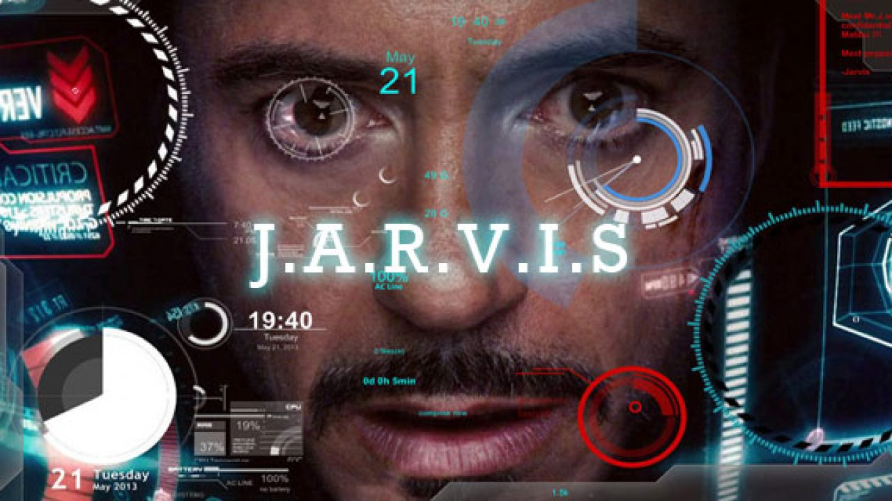

# GitHub 이력서 콘테스트 해커톤 
*************************************
## 소개
------------------------------------ 

#### 서휘도(Hwido-Seo)

E-mail: Baeksa01@hallym.ac.kr 
GitHub: https://github.com/SeoHwiDo 

------------------------------------ 
## 학력
------------------------------------ 

>서울경복고등학교 졸업
>>관련 기사:<a href=https://tong.joins.com/archives/45346/>마지막 사진 앞줄 오른쪽</a>

>한림대학교 소프트웨어융합대학 재학(20년 입학)
>>관련 기사:<a href=https://hlsw.hallym.ac.kr/index.php?mt=page&mp=5_1&mm=oxbbs&oxid=1&cpage=1&key=&val=&CAT_ID=0&BID=302&cmd=view/>마지막 사진 검은 옷 체험자</a>

------------------------------------------
## 흥미 분야
-----------------------------------------

VR,AR기술을 이용한 3D 오픈월드 게임 기획 및 개발

딥러닝 기술을 이용한 개인 맞춤형 비서 프로그램 개발

반 영구 업그레이드 게임 콘솔 개발 

